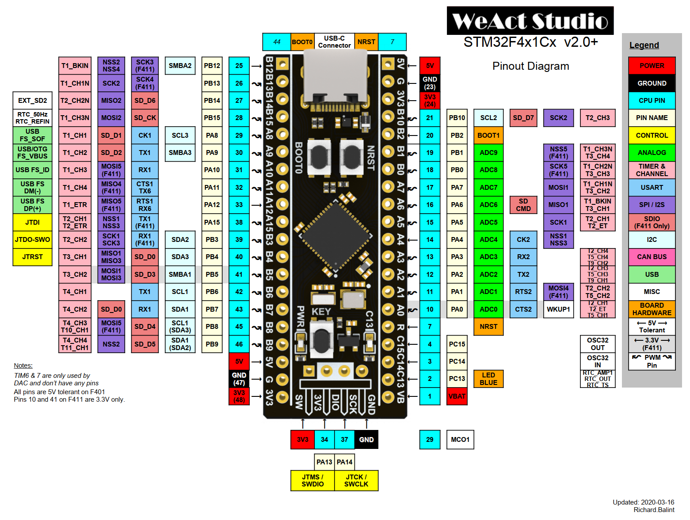
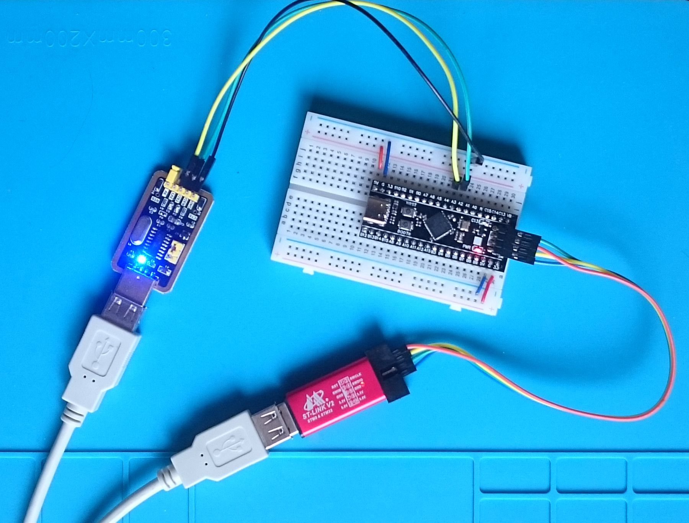

# BlackPill board (WeAct STM32F411CEU6) support for Mbed OS 6

[WeAct Black Pill board](https://github.com/WeActTC/MiniF4-STM32F4x1) is series of small affordable boards with STM32F4x1 MCUs.
These boards have the same format like [BluePill](https://stm32duinoforum.com/forum/wiki_subdomain/index_title_Blue_Pill.html),
but have significantly more RAM, flash memory and have single precision floating point unit.

This repository provides Mbed OS 6 support for a board with [STM32F411CEU6](https://www.st.com/en/microcontrollers-microprocessors/stm32f411ce.html) MCU.

## Board description

### Microcontroller features

* STM32F411CEU6 in UFQFPN48 package
* ARM®32-bit Cortex®-M4 CPU
* 100 MHz max CPU frequency
* VDD from 1.7 V to 3.6 V
* 512 KB Flash
* 128 KB SRAM
* GPIO (32) with external interrupt capability
* All IO ports 5 V tolerant
* 12-bit ADC (1) with 10 channels
* RTC
* Timers (8)
* I2C (3)
* USART (3)
* SPI (3)
* I2S (3)
* SDIO (1)  
* USB 2.0 full-speed

### Board features

* Small foot-print
* Flexible board power supply: USB VBUS or external source (3.3V, 5V)
* User LED: LED1
* Programming/Debug port
* Type-C USB connector
* High speed external quartz oscillator 25 MHz
* Low speed external quartz oscillator 32,768 KHz

### Board pinout

### Default pins

| description | pin |
|---|---|
| STDIO_UART_TX | PA_2 |
| STDIO_UART_RX | PA_3 |
| led pin (LED1 alias) | PC_13 |
| user button pin (BUTTON1 alias) | PA_0 |

### Mbed OS version support

| Mbed OS | status |
|---|---|
| 6.5 | Compiles and runs ok |
| 6.6 | Compiles and runs ok, but you need to press reset button (NRST) during firmware uploading. This bug is caused by the pull request [#13777](https://github.com/ARMmbed/mbed-os/pull/13777), but fixed in the [#14032](https://github.com/ARMmbed/mbed-os/pull/14032). |
| 6.7 | Compiles and runs ok |
| 6.8 | Compiles and runs ok |
| 6.9 | Compiles and runs ok |
| 6.10 | Compiles and runs ok |

## Project configuration

After base mbed project creation and configuration perform the following configuration to setup board:

1. Go to project root directory.
2. Run `mbed add https://github.com/vznncv/TARGET_BLACKPILL_F411CE.git` to add this library to your project.
3. Copy `custom_target.json` from library folder to your project folder.
4. Run `mbed target BLACKPILL_F411CE` command to set default board.
5. Run `mbed toolchain GCC_ARM` to set default toolchain.
6. Run `mbed export ...` command if you use IDE, as new files have been added to you project.

note: currently only GCC ARM toolchain is supported.

To program/debug you project, connect hardware debugger and optionally usb to serial adapter to
pins PA_3, PA_2 like it's shown bellow:
   

   
note: a serial adapter is requires only for `printf`/`scanf` functionality and tools that use it (like *greentea* tests).

### Examples

Base examples can be found in the `examples` folder.

## License

Unless specifically indicated otherwise in a file, files are licensed under the MIT license.
